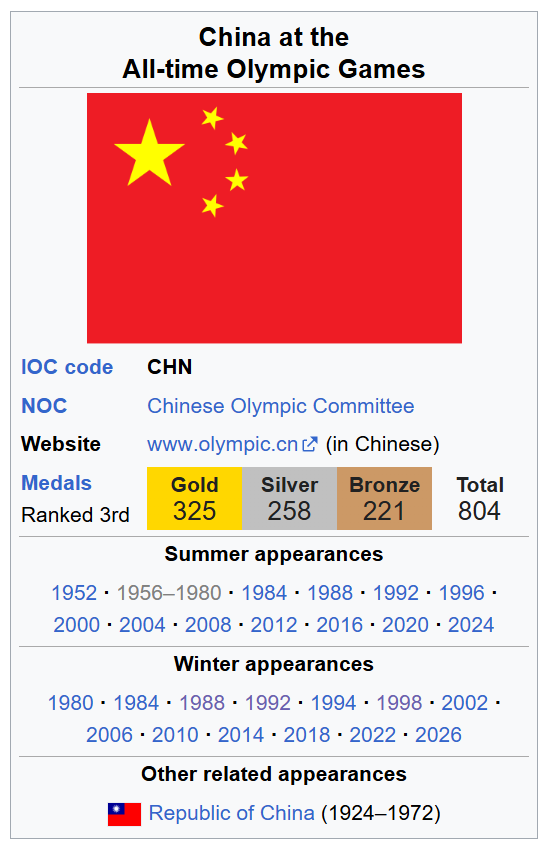

# Olympics Data Consistency Audit

This project analyzes inconsistencies between English and Chinese Wikipedia Olympic datasets.

## Goal
Detect missing Winter Olympic participation records in Chinese Wikipedia.

## Method
- Extract Winter Olympic appearance years from English Wikipedia
- Compare with Chinese Wikipedia
- Identify missing entries
- Generate standardized wiki patches

## Result
Missing years detected:
1980, 1984, 1988, 1992, 1994, 1998

## Tools
- Python
- Excel
- MediaWiki API
- Data validation techniques

## Impact
Improved accuracy of Olympic participation records and demonstrated cross-language data QA workflow.

## Comparison Screenshots

### Reference Dataset (English Wikipedia)

### Target Dataset with Missing Entries (Chinese Wikipedia)

## Data

- data/china_winter_participation_1980_1998.csv
- data/wiki_comparison_winter_olympics.csv
- data/winter_olympics_events_1980_1998.csv

